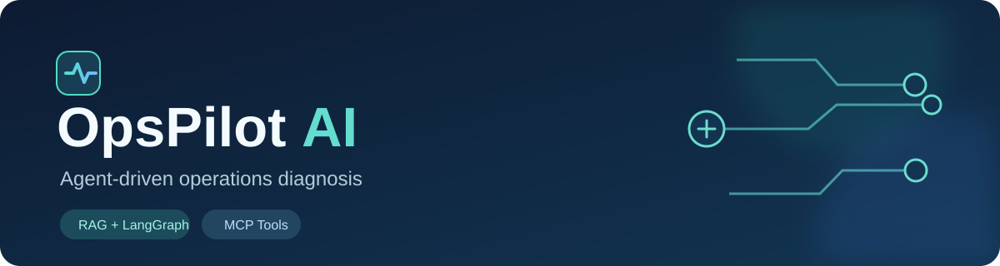
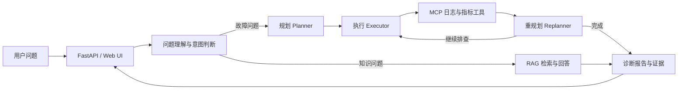

<div align="center">



# OpsPilot AI

**把运维问题变成可追踪的诊断步骤与证据链。**

基于 FastAPI、LangGraph、RAG 和 MCP 的智能运维 Agent 示例项目。


</div>

## 项目做什么

输入“CPU 告警怎么排查？”这类问题，系统先理解意图，再决定走知识问答或故障诊断流程。诊断流程会规划步骤、调用日志与监控工具、根据结果调整计划，并以流式事件输出过程和报告。

| 能力 | 对应实现 |
| --- | --- |
| 双路线 Agent | [统一入口与路由](app/services/agent_orchestrator_service.py)：故障诊断走 Plan–Execute–Replan；知识问题走 RAG Agent |
| 可追踪诊断 | [LangGraph 状态图](app/services/aiops_service.py)组织规划、执行与重规划；[诊断工作台](app/services/diagnostic_workbench_service.py)整理过程与证据 |
| 知识检索 | 文档上传、向量索引、关键词召回、查询理解和重排；附带 [示例运维知识库](aiops-docs/) |
| 工具接入 | [MCP 客户端](app/agent/mcp_client.py)连接日志和指标工具；仓库中的两个 MCP 服务提供**模拟数据**，便于本地演示 |
| 交互界面 | [静态 Web 界面](static/)展示对话、流式回答、诊断步骤和报告导出 |

> 本仓库面向本地学习与演示。随附 MCP 服务返回模拟日志/指标，不代表已接入真实生产监控。诊断建议需要人工核对。

## 工作方式



更细的代码入口见 [架构速览](docs/architecture.md)。

## 本地运行

**需要：** Python 3.11–3.13、Docker、[uv](https://docs.astral.sh/uv/) 和你自己的 DashScope API Key。Milvus 由 Docker Compose 启动。首次安装依赖和拉取镜像需要联网。

1. 克隆仓库，在项目根目录创建环境并安装依赖：

   ```bash
   uv sync
   ```

2. 将 `.env.example` 复制为 `.env`，填写 `DASHSCOPE_API_KEY`、`AUTH_PASSWORD`（至少 12 个字符）和 `AUTH_SECRET`（至少 32 个字符）。可用 `python -c "import secrets; print(secrets.token_urlsafe(32))"` 生成签名密钥。`.env` 已被 Git 忽略。

3. 启动数据库和示例 MCP 工具。在三个终端分别运行：

   ```bash
   docker compose -f vector-database.yml up -d
   uv run python mcp_servers/cls_server.py
   uv run python mcp_servers/monitor_server.py
   ```

4. 在第四个终端启动 API：

   ```bash
   uv run uvicorn app.main:app --host 127.0.0.1 --port 9900
   ```

打开 `http://127.0.0.1:9900`；交互式 API 文档在 `/docs`，健康检查在 `/health`。Windows 也可使用 `start-project.bat` 和 `stop-project.bat`，配置步骤相同。

## 试一个请求

在 Web 界面输入：

> Java 服务 CPU 升高，我该先看哪些证据？

或者调用诊断接口，观察 SSE 事件中的计划、执行步骤和最终报告：

```bash
curl -N -X POST http://127.0.0.1:9900/api/aiops \
  -H "Content-Type: application/json" \
  -d '{"session_id":"demo-001"}'
```

常用入口：`POST /api/chat`、`POST /api/chat_stream`、`POST /api/aiops`、`POST /api/upload`。请求和响应细节以 `/docs` 为准。

## 目录导航

```text
app/api/            HTTP 与 SSE 接口
app/agent/aiops/    Planner / Executor / Replanner
app/services/       编排、检索、向量索引、记忆与诊断工作台
app/core/           模型与 Milvus 客户端
mcp_servers/        示例日志与监控 MCP 服务
aiops-docs/         示例故障知识文档
static/             Web 界面
data/rag/           意图树与术语映射样例
data/eval/          检索评测样例
```

